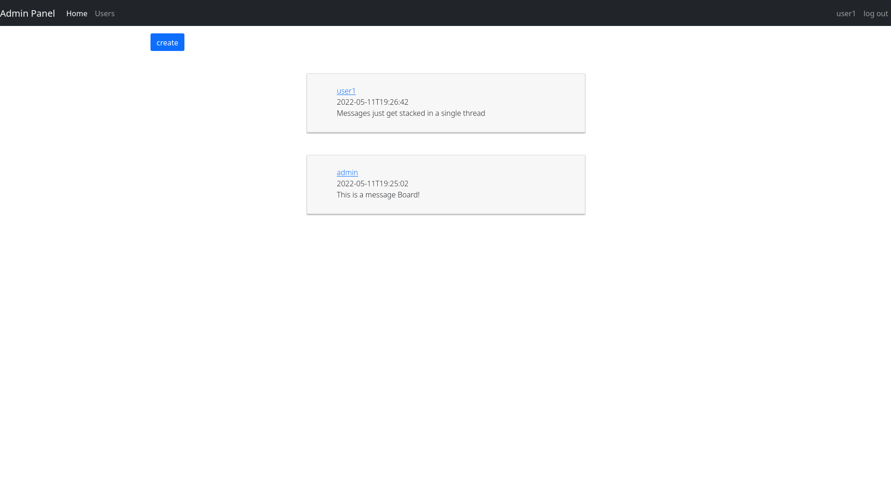
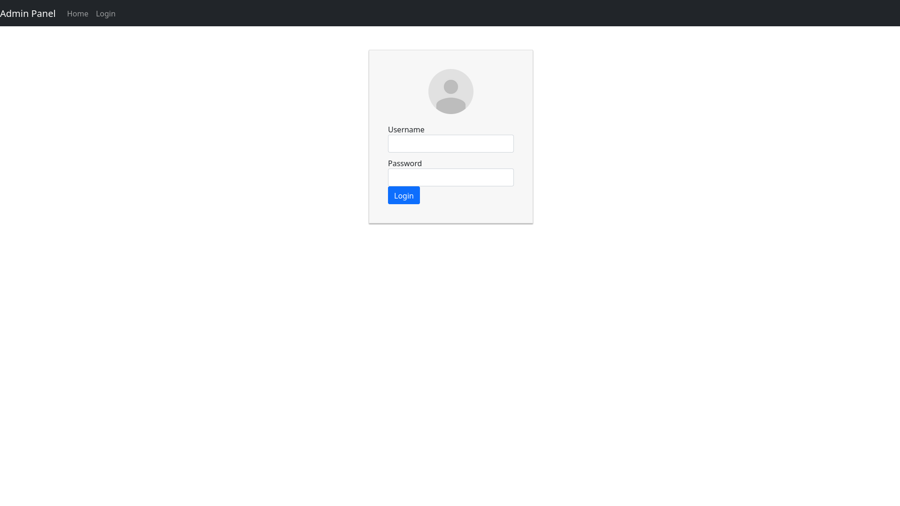
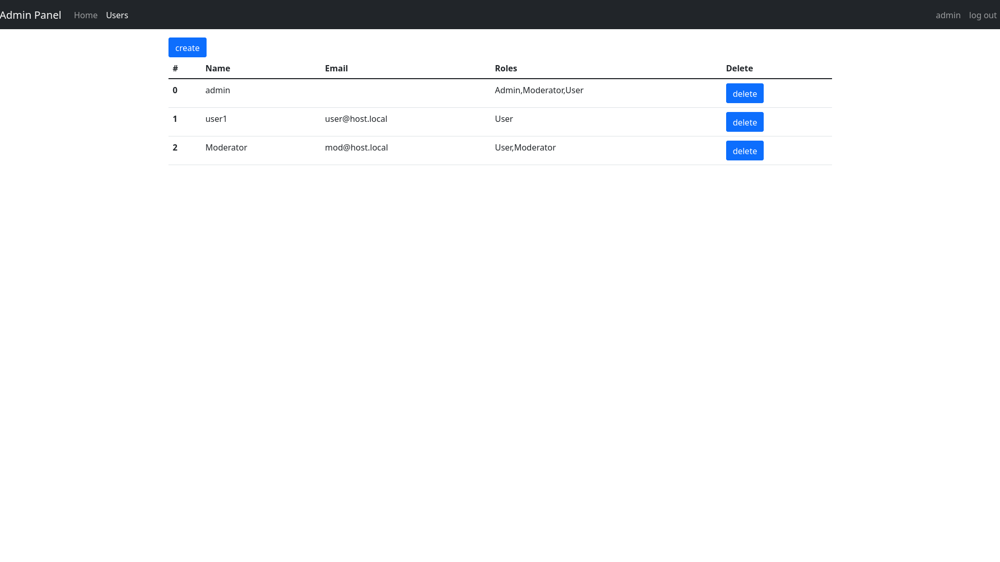

# A simple message board

I wrote this application as a prototype for a university project and to get more familiar with fullstack development and web security.

User management is done throught EC signed JWT tokens.






### Architecture

This application contains 5 different components:

- A Single Page Application written in React and served by Nginx

- A user management and authentification backend written in Rust using Actix-web

- A content backend providing message management written in Go

- An traefick Edge-Proxy

- a mongodb Database

### Building

1. create ssl certificates for traefick and an EC keypair for JWT tokens in /cert

2. run ```sudo docker-compose build```
